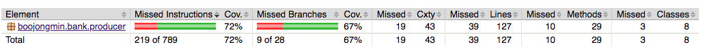
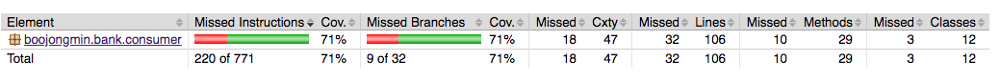

# 카프카를 이용한 BANK 예제

## 들어가기전
카프카를 이용해서 사용자 로그를 수집한다. 
- Producer: 비지니스 코드 동작 후 로그를 발행
- Consumer: 로그가 발행되면 Inmemory DB에 저장.
- Webserver: http 호출시 Inmemory DB에 저장된 값을 반환 

## 개발에 사용한 도구
- docker, docker-compose, kafka 설치
- java 8, kotlin
- maven 3
- intellij

## 실행방법
```shell
mkdir bank-example
cd bank-example
git clone https://github.com/wurstmeister/kafka-docker.git
cd kafka-docker
ifconfig # ip 확인
vi docker-compose.yml  #  KAFKA_ADVERTISED_HOST_NAME: {ip 수정}
sudo docker-compose up -d
cd ..
git clone https://github.com/boojongmin/bank_example.git
cd bank_example
mvn package
# consumer 실행
nohup java -jar consumer/target/consumer-0.0.1-SNAPSHOT-jar-with-dependencies.jar &
# tail -f nohup.out
# producer 실행
java -jar producer/target/producer-0.0.1-SNAPSHOT-jar-with-dependencies.jar

# 전체 조회 
curl localhost:467/member

# 상세조회(number 필드로 조회) 
curl localhost:4567/member/13

kill $(pgrep -a java | grep consumer | awk '{print $1}')
```

### 응답값 샘플
```json
{
  "number" : 1,
  "name" : "member_1",
  "createdAt" : 1540802605849,
  "accounts" : [ {
    "number" : "1c696d59-4ec6-4352-b785-0a360b6d2040",
    "createdAt" : 1540802606901,
    "transactions" : [ {
      "amount" : 9663,
      "createdAt" : 1540802607893
    }, {
      "amount" : 398,
      "createdAt" : 1540802608894
    }, {
      "amount" : 7819,
      "bankEnum" : "BANK1",
      "outAccountNumber" : "XXXX-XXXX-XXXX",
      "name" : "XXX",
      "createdAt" : 1540802610200
    } ]
  } ]
}%
```

### line coverage 확인(jacoco maven plugin 사용)
```
mvn test
firefox producer/target/site/jacoco/index.html 
firefox consumer/target/site/jacoco/index.html 
```

##### 라인 커버리지
- producer

- consumer


### Concurrency
- producer
  - Thread를 1000개 생성하고 1000번씩 카프카에 메세지 전달.(Thread 제어는 CountDownLatch 사용.)
  - key가되는 member number값은 AtomicInteger를 이용하여 thread safe하게 처리
- consumer
  - 작업별 메세지 전달은 1분의 간격이 있으므로 특정 사용자의 이력은 순서가 보장된다고 가정하고 프로그래밍
  - KafkaConsumer는 멀티 스레드를 지원하지 않으므로 consumer를 사용할 스레드 갯수만큼 만들어서 동작 시킴.
  - 생성할 consumer는 partition의 갯수를 확인후 최대 16개의 Thread를 생성(이하는 partition의 갯수만큼만 생성)
  - 저장소로 사용할 inmemory db는 ConcurrentMap interface로 타입을 지정해서 thread에 안전한 Map 구현체만 사용.
    - main에는 Hazelcast 사용, test에는 ConcurrentHashMap 사용. 

### Clean Code에 대한 준수 사항
- 명시적으로 재할당이 필요한 변수 외에는 final로 처리(var, val 사용)
- 상속이 불필요한 class는 final class로 선언(코틀린은 기본이 final class)
- 의존성 주입을 이용하여 유연하게 객체를 다룰수 있어. 프로덕션. 테스트 코드 작성 용이하게 리팩토링
- 함수의 메서드는 하나의 역할만 하도록 작성.
- 가능하면 사이트 이펙트 없는 함수를 작성
- 바운디드 컨텍스트를 생각하고 엔티티 설계.
- 함수내에 참조형 객체를 조작하는 행위를 하지 않는다.(사이드이펙트 방지)
- 클래스는 어떤 업무인지 유추가 가능하게 메서드의 이름은 행위를 나타내도록 명시적인 작명을 하려 노력.
 - 네이밍을 통해 코드의 의도를 파악하도록 노력.
- 함께 작업하는 코드이므로 포멧터 적용하도록 노력(현재 프로젝트는 intellij의 기능으로 포매팅함.)
- 단일책임 원칙, 응집도를 높이기 위한 클래스 분리
- 중복코드는 하나의 메서드로 추출
- 복잡한 if else문은 전략패턴으로 변경해서 코드의 가독성을 높임.
- 테스트코드를 작성하면서 리팩토링을하고, 테스트코드가 있는 상태에서 적극적으로 리팩토링을 실시한다.
- 불변객체 사용
- 상속보다는 컴포지션을 사용


